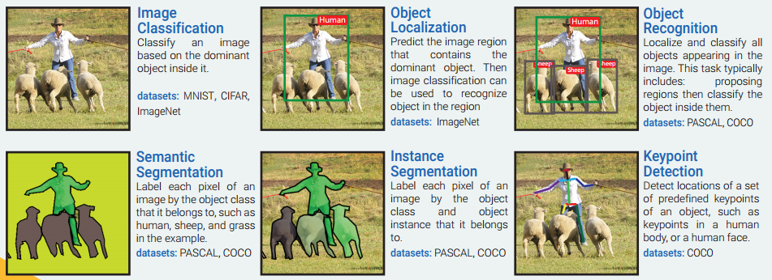
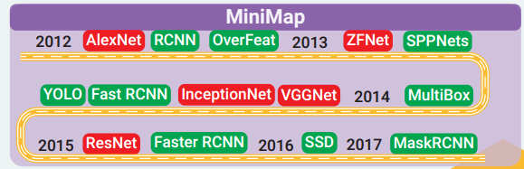

Object Recognition任务包含：

目标分割、目标识别、目标检测和目标跟踪

再细分
- Scene categorization
- Image-level annotation: are there people?

主要模型发展历史：

图像识别中，目标分割、目标识别、目标检测和目标跟踪

## dataset
[goto](../dataset.md)

## reference
- https://www.zhihu.com/question/36500536/answer/281943900
- https://github.com/Nikasa1889/HistoryObjectRecognition
